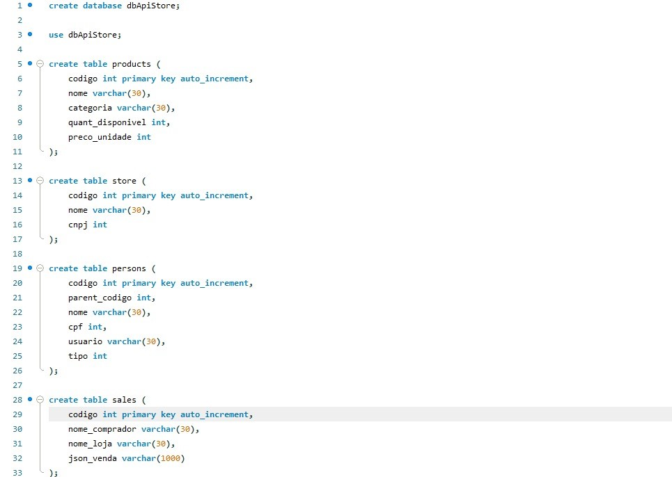
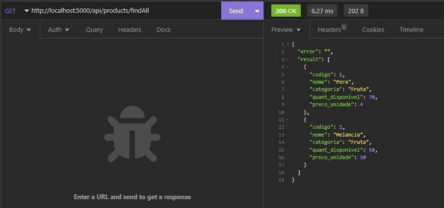
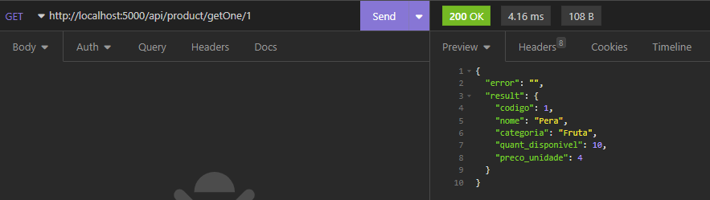
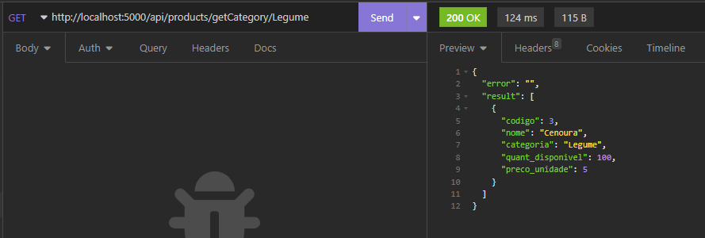
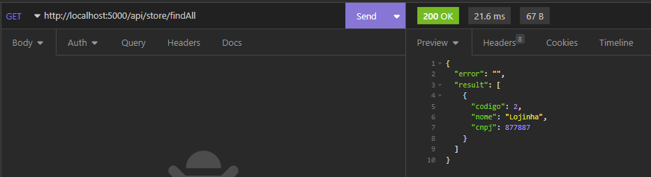
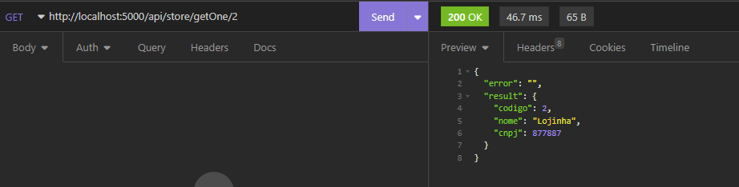
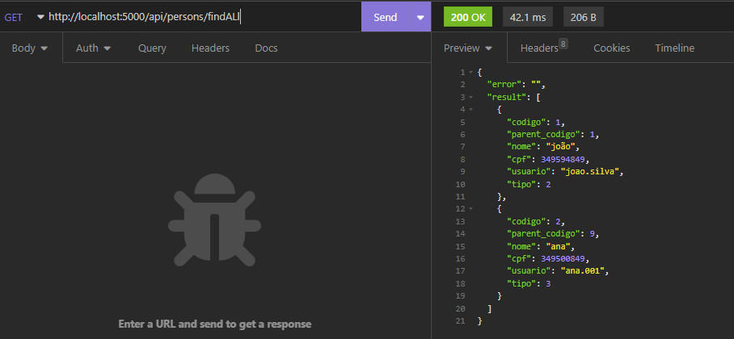
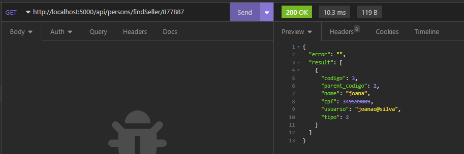
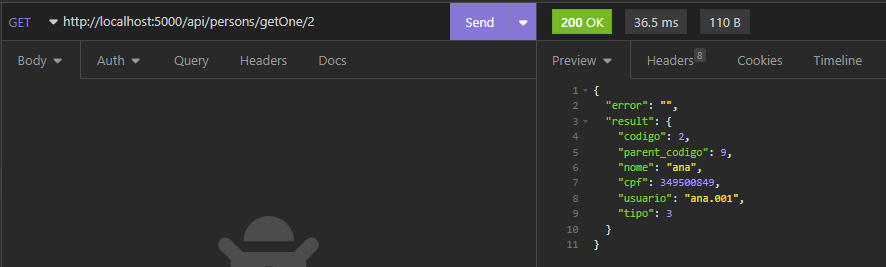

<h2 align='center'>Projeto - Backend - ApiRest </h2>
<h2 align='center'>Tema do Projeto: Frutos do Pará</h2>

## 📄 Sobre
Primeira parte do projeto, desenvolvimento de uma API REST com Node.js, Express e MySQL, e todas as operações do CRUD para comprovação do funcionamento da API.

 

## 🔨 Ferramentas

- [Node](https://nodejs.org/pt-br/docs/)
- [Express](https://expressjs.com/)
- [MySQL](https://www.mysql.com/)

 

##  Modelo Logico - Fluxograma

<figure align="center">

<figcaption>Fluxograma simples das etapas da aplicação.</figcaption>
</figure>

 

## Tabelas do Banco - MySQL

<figcaption>Quatro tabelas: <strong>Products, Store, Persons, Sales </strong>.</figcaption>

## Operações do CRUD - Insomnia

GET

Products

GET findAll - Lista todos os produtos

GET oneGet - Busca um produto especifico, usando como parametro seu codigo

GET Category - Busca todos os produtos de uma determinada categoria

Store

GET findAll - Lista todas a lojas

GET oneGet - Busca uma loja especifica

Persons

GET findAll - Lista todas os tipos de pessoas cadastradas

GET findSeller - Busca um vendedor vinculado a uma loja

GET oneGet - Busca um tipo de pessoa especifica

Sales

GET findAll - Lista todas as vendas

GET oneGet - Busca uma venda especifica

